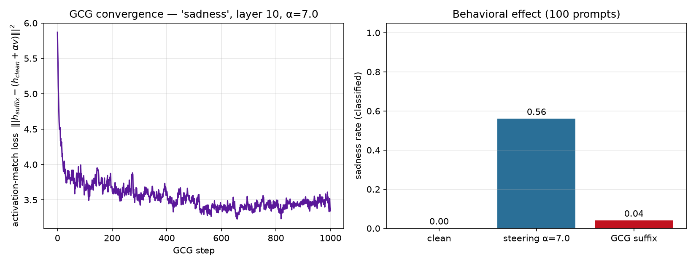

# GCG run — sadness, layer 10

- **suffix length:** 8 tokens
- **target scale (α):** 7.0
- **objective:** kl | steps 1000 | seed 0 | opt prompts 2
- **best loss:** 3.229 | **proj:** 1.176 / 7.0 | cos_to_v 0.235

## Suffix

```
 utilize Everyday unwﾆﾆﾆﾆ tired born詩 spoken
```

## Behavioral effect (concept rate on held-out prompts)

| condition | rate | mean prob |
|-----------|-----:|----------:|
| clean | 0.00 | 0.02 |
| activation steering α=7.0 | 0.56 | 0.49 |
| **GCG suffix (input only)** | **0.04** | 0.11 |

Interpretation: the input suffix reproduces 7% of the activation-steering effect through the input channel alone (100 prompts).

## Plots


