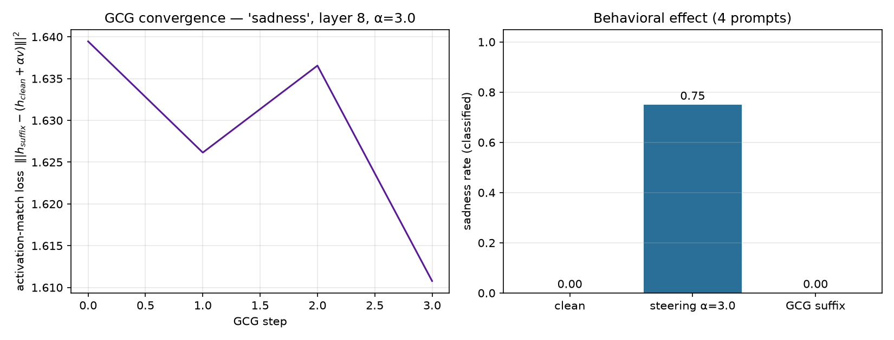

# GCG run — sadness, layer 8

- **suffix length:** 6 tokens
- **target scale (α):** 3.0
- **objective:** kl | steps 4 | seed 0 | opt prompts 1
- **best loss:** 1.611 | **proj:** 0.283 / 3.0 | cos_to_v 0.170

## Suffix

```
! Flo!lagTail!
```

## Behavioral effect (concept rate on held-out prompts)

| condition | rate | mean prob |
|-----------|-----:|----------:|
| clean | 0.00 | 0.03 |
| activation steering α=3.0 | 0.75 | 0.71 |
| **GCG suffix (input only)** | **0.00** | 0.12 |

Interpretation: the input suffix reproduces 0% of the activation-steering effect through the input channel alone (4 prompts).

## Plots


